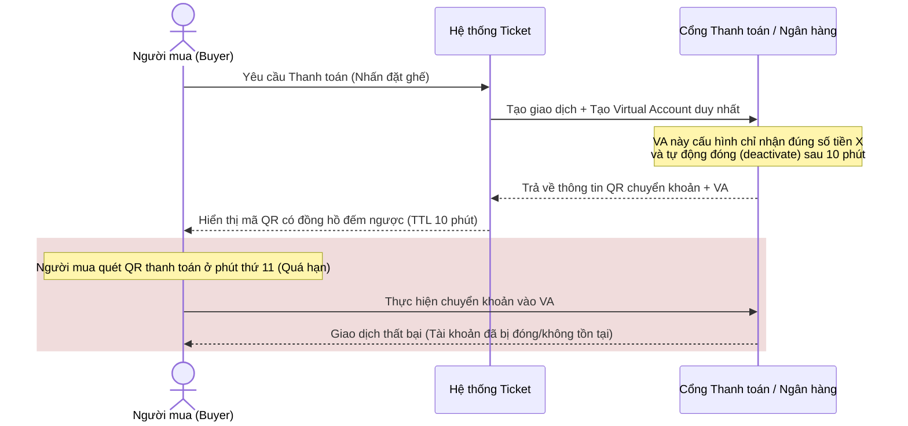
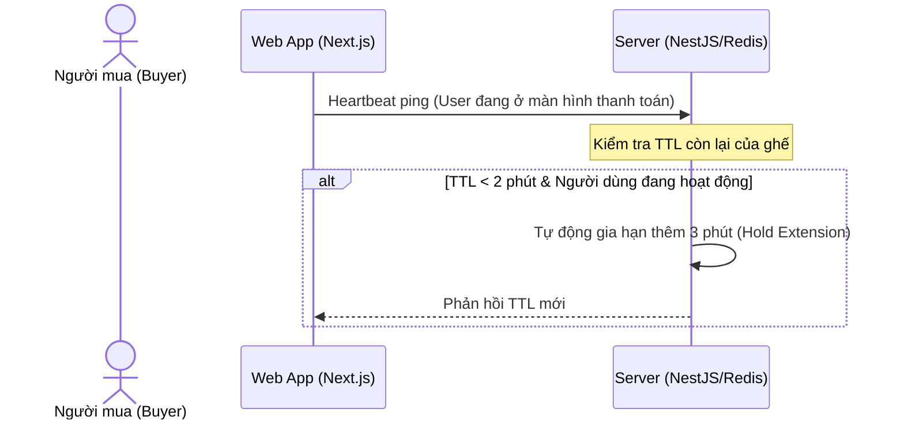

# Giải pháp Kiến trúc Giải quyết Triệt để Vấn đề TTL Giữ Ghế & Thanh toán

> [!NOTE]
> Tài liệu này đề xuất 4 giải pháp kiến trúc nâng cao giúp xử lý triệt để rủi ro lệch pha thời gian (race condition, timeout, overselling) giữa hệ thống bán vé và cổng thanh toán ngân hàng khi giữ ghế tạm thời (Seat Hold TTL).

---

## Giải pháp 1: Tự động đóng cổng chuyển khoản từ phía Ngân hàng (Dynamic Virtual Account Escrow)
Đây là giải pháp **triệt để nhất** và được các hệ thống lớn như Vé Tàu Hỏa (DSVN), rạp chiếu phim, vé máy bay áp dụng. Thay vì dùng số tài khoản ngân hàng tĩnh, hệ thống sẽ tích hợp cổng thanh toán hỗ trợ **Virtual Account (Tài khoản Định danh Động)** như PayOS, SePay, Casso hoặc cổng ngân hàng trực tiếp.



### Nguyên lý hoạt động:
* Khi đơn hàng được tạo, hệ thống gọi API bên cổng thanh toán để tạo một **Virtual Account (VA) dùng 1 lần**. Cấu hình VA này có thời gian sống (expiration) trùng khớp với TTL giữ ghế (ví dụ: đúng 10 phút).
* Nếu người dùng chuyển tiền trước 10 phút: Giao dịch thành công, webhook gửi về lập tức chuyển ghế sang `SOLD`.
* Nếu quá 10 phút: Cổng thanh toán/Ngân hàng tự động **vô hiệu hóa tài khoản ảo** này. Nếu người dùng cố quét QR chuyển tiền ở phút thứ 11, ứng dụng ngân hàng sẽ báo lỗi *"Tài khoản không tồn tại hoặc đã ngừng hoạt động"*. Tiền không bị trừ khỏi tài khoản người dùng.
* **Đánh giá**: 🟢 **Hoàn hảo**. Triệt tiêu 100% rủi ro trừ tiền muộn và tranh chấp vé.

---

## Giải pháp 2: TTL Động theo Phương thức Thanh toán (Dynamic TTL Strategy)
Mỗi phương thức thanh toán có thời gian xử lý và độ trễ giao dịch khác nhau. Hệ thống không nên áp dụng một mức TTL cứng nhắc cho toàn bộ các cổng.

### Ma trận phân bổ TTL Động:

| Phương thức | Tốc độ xử lý | TTL khuyến nghị | Lý do |
| :--- | :---: | :---: | :--- |
| **Thẻ Quốc tế (Stripe/Visa)** | Tức thời (< 3s) | **5 Phút** | Khách hàng chỉ cần nhập OTP, cổng thanh toán trừ tiền trực tiếp trên luồng API, không cần thao tác chuyển máy. |
| **Ví Điện tử (Momo/ZaloPay)** | Nhanh (< 5s) | **7 Phút** | Chuyển hướng sang App ví điện tử, thời gian xác nhận nhanh bằng vân tay/mã pin. |
| **VietQR / Chuyển khoản ngân hàng** | Chậm (30s - 3 phút) | **12 - 15 Phút** | Khách hàng cần mở app ngân hàng khác, quét QR hoặc nhập tay thông tin, hệ thống ngân hàng liên kết Napas có thể trễ. |

```typescript
// Blueprint cấu hình TTL động trong NestJS Service
function getHoldTimeout(paymentMethod: string): number {
  switch (paymentMethod) {
    case 'CREDIT_CARD':
      return 300; // 5 phút (giây)
    case 'E_WALLET':
      return 420; // 7 phút (giây)
    case 'BANK_TRANSFER':
      return 900; // 15 phút (giây)
    default:
      return 600; // 10 phút mặc định
  }
}
```
* **Đánh giá**: 🟢 **Dễ triển khai**. Giảm thiểu rủi ro cho chuyển khoản ngân hàng mà vẫn tối ưu được thời gian thu hồi ghế cho thẻ tín dụng.

---

## Giải pháp 3: Cơ chế Gia hạn thông minh dựa trên Tương tác (Client Heartbeat & Hold Extension)
Nhiều trường hợp người dùng đang cắm cúi nhập mã OTP ngân hàng hoặc đang thực hiện chuyển khoản thì thời gian đếm ngược trôi hết. Việc gia hạn tự động dựa trên tương tác thực tế giúp tăng tỷ lệ chuyển đổi đơn hàng.



### Nguyên lý hoạt động:
* Khi ở màn hình thanh toán, client (Next.js) duy trì kết nối WebSocket hoặc gửi định kỳ 30 giây một gói tin **Heartbeat** lên Server để thông báo người dùng vẫn đang ở trang thanh toán và có hành vi chờ đợi.
* Nếu Server phát hiện TTL giữ ghế của người này dưới 2 phút, đồng thời ghi nhận hành vi tích cực của client, hệ thống sẽ thực hiện lệnh `EXPIRE` trong Redis để kéo dài thời gian giữ chỗ thêm một khoảng nhỏ (ví dụ: cộng 3 phút, tối đa không quá 2 lần gia hạn).
* Nếu người dùng tắt trình duyệt hoặc thoát trang thanh toán, heartbeat dừng lại và ghế sẽ hết hạn đúng TTL gốc.
* **Đánh giá**: 🟡 **Cải thiện UX tốt**, nhưng cần phòng tránh bot spam gửi heartbeat ảo để giữ ghế vô thời hạn (cần rate limit heartbeat nghiêm ngặt và giới hạn số lần gia hạn tối đa `MAX_EXTENSIONS = 2`).

---

## Giải pháp 4: Kiến trúc Chờ Đối soát Tự động (Grace Period & State Machine Buffer)
Nếu không tích hợp được Virtual Account động (Giải pháp 1) và vẫn dùng tài khoản ngân hàng tĩnh dẫn đến việc nhận tiền muộn sau khi TTL đã hết, hệ thống cần được thiết kế dưới dạng một **StateMachine chặt chẽ** có vùng đệm thời gian (Grace Period).

```
[ AVAILABLE ] 
     │
     ▼ (Giữ chỗ)
[   HOLD    ] ──(Hết hạn TTL)──> [ AVAILABLE ]
     │                                │ (Có người khác mua mất)
     ▼ (Quét QR thanh toán muộn)       ▼
[ PENDING_MATCH ] ──────────────> [ REFUND_PENDING ] (Chuyển hoàn tiền tự động)
```

### Nguyên lý hoạt động:
* Khi thời gian hold 10 phút kết thúc, hệ thống không trả ngay ghế về trạng thái `AVAILABLE` hoàn toàn tự do nếu phát hiện giao dịch ngân hàng đang bị pending. Thay vào đó, ghế được đưa vào trạng thái đệm **Grace Period (ví dụ: thêm 2 phút)**. Trong 2 phút đệm này, người khác vẫn chưa thể mua, nhưng đồng hồ của user cũ đã báo hết giờ.
* Nếu Webhook báo tiền về trong khoảng 2 phút đệm này, hệ thống khớp lệnh thành công.
* Nếu tiền về muộn hẳn sau khi ghế đã thực sự chuyển sang `AVAILABLE` và bị người khác mua mất:
  * Hệ thống phát hiện sự xung đột: Đơn hàng cũ chuyển sang trạng thái `MANUAL_CHECK` hoặc `REFUND_PENDING`.
  * Kích hoạt hoàn tiền tự động thông qua API cổng thanh toán, đồng thời gửi email thông báo xin lỗi khách hàng kèm ưu đãi giảm giá cho lần đặt sau.
* **Đánh giá**: 🟡 **An toàn về mặt dữ liệu**, tuy nhiên nhà tổ chức sẽ phải chịu chi phí hoàn tiền (hoặc phí giao dịch hoàn).

---

## 5. Khuyến nghị Giải pháp tối ưu từ Antigravity

> [!IMPORTANT]
> Để xây dựng một hệ thống đặt vé đẳng cấp, đạt chuẩn sản xuất cao, tôi khuyến nghị bạn nên kết hợp **Giải pháp 1 (Virtual Account động)** và **Giải pháp 2 (TTL Động)**.

* **Tại sao?**
  - **Virtual Account động** triệt tiêu tận gốc vấn đề chuyển khoản muộn. Khách hàng không thể chuyển khoản khi đã hết hạn, hệ thống không bao giờ bị lệch dòng tiền hay phát sinh lỗi overselling.
  - **TTL Động** giúp tối ưu hóa việc quay vòng kho ghế trống. Ghế thanh toán bằng ví/thẻ được giải phóng rất nhanh để nhường cơ hội cho khách hàng khác, trong khi khách hàng chuyển khoản ngân hàng truyền thống có đủ thời gian mở app thao tác mà không bị áp lực thời gian.
