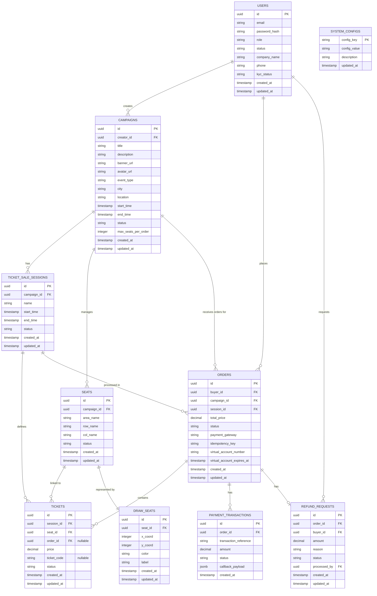
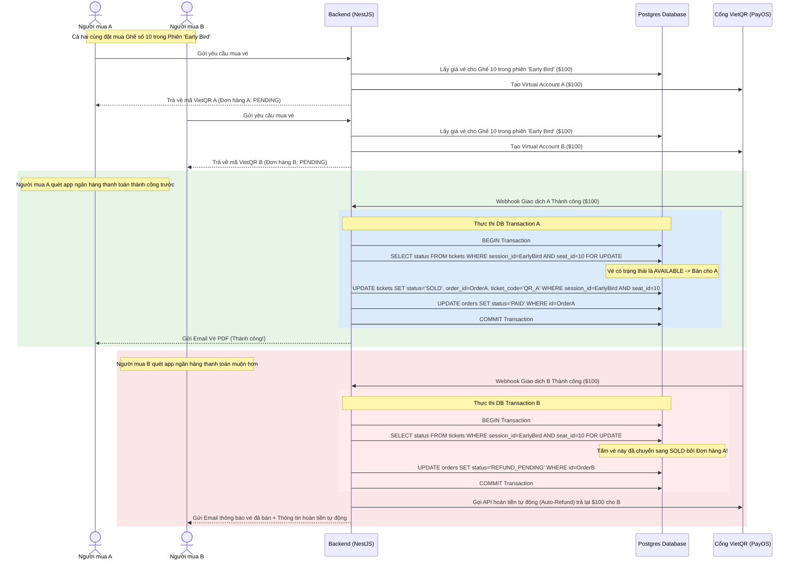

# Tài liệu Đặc tả Yêu cầu Hệ thống & Thiết kế ERD (SRS - Software Requirements Specification)

> [!IMPORTANT]
> **CẬP NHẬT KIẾN TRÚC MỚI NHẤT (QUAN HỆ N - N GIỮA PHIÊN BÁN VÀ GHẾ)**:
> 1. **Khôi phục bảng `TICKETS` làm bảng cầu nối N - N**:
>    - Mỗi phiên bán vé (`TICKET_SALE_SESSIONS`) có quan hệ **N - N** với danh sách ghế vật lý (`SEATS`).
>    - Bảng cầu nối cho quan hệ N - N này được đặt tên là **`TICKETS`**.
>    - Trường **`price`** (giá vé), **`ticket_code`** (mã QR soát vé) và **`status`** (trạng thái bán vé) sẽ nằm trực tiếp trong bảng phụ **`TICKETS`** này.
>    - Loại bỏ hoàn toàn bảng `SEAT_AREAS` và bảng `SESSION_SEAT_PRICES`.
> 2. **Thiết lập quan hệ 1 - N giữa `ORDERS` và `TICKETS`**:
>    - Một đơn đặt hàng (`ORDERS`) sẽ có quan hệ **1 - N** trực tiếp với bảng **`TICKETS`** (Một đơn hàng có thể mua và sở hữu nhiều vé điện tử).
> 3. **Bảng `SEATS` làm kho ghế vật lý gốc**:
>    - Bảng `SEATS` được tinh giản để chỉ lưu trữ kho ghế vật lý (vùng ghế `area_name`, hàng, cột) và giữ quan hệ **1 - 1** với bảng tọa độ hiển thị đồ họa **`DRAW_SEATS`**.
> 4. **Ảnh đại diện kép cho Sự kiện**: Mỗi `CAMPAIGNS` (Sự kiện) cấu hình bắt buộc 1 ảnh banner rộng (`banner_url`) và 1 ảnh đại diện nhỏ (`avatar_url`).

---

## 1. Phân tích Vai trò (System Roles) & Ma trận Quyền

Hệ thống được tinh gọn tối đa thành 3 nhóm đối tượng chính:

| Vai trò | Ký hiệu | Mô tả ngắn |
| :--- | :--- | :--- |
| **Guest (Khách vãng lai)** | `GUEST` | Người chưa đăng nhập. Chỉ được xem thông tin sự kiện công khai và sơ đồ ghế. |
| **User (Người dùng hệ thống)** | `USER` | **[Hợp nhất]** Tài khoản người dùng tiêu chuẩn sau khi đăng ký. Có toàn quyền: Mua vé, thanh toán, đồng thời tự tạo sự kiện, thiết kế sơ đồ ghế, cấu hình bán vé và quản lý doanh thu sự kiện của chính mình. |
| **Admin (Quản trị viên)** | `ADMIN` | Quản trị viên hệ thống. Quản lý tài nguyên, kiểm duyệt thể loại sự kiện, phê duyệt KYC rút tiền của User, giám sát tải và can thiệp khẩn cấp. |

### Ma trận chức năng tối cao (High-Level Permission Matrix)

| Nhóm Chức năng / Module | Guest | User (Mua + Bán) | Admin |
| :--- | :---: | :---: | :---: |
| **Xem sự kiện & sơ đồ ghế trực quan** | ✅ | ✅ | ✅ |
| **Đăng ký / Đăng nhập tài khoản** | ✅ | ✅ | ✅ |
| **Thanh toán & Nhận vé điện tử (Mua)** | ❌ | ✅ | ❌ |
| **Quản lý đơn hàng mua & Vé của tôi** | ❌ | ✅ | ❌ |
| **Tạo mới Chiến dịch / Sự kiện (Bán)** | ❌ | ✅ | ✅ |
| **Thiết kế sơ đồ ghế & Giá vé chiến dịch** | ❌ | ✅ | ✅ |
| **Cấu hình phiên bán vé & Giá vé theo phiên**| ❌ | ✅ | ✅ |
| **Xem báo cáo doanh thu sự kiện tự tạo** | ❌ | ✅ | ✅ |
| **Đối soát & Quét QR check-in tại cổng** | ❌ | ✅ | ✅ |
| **Phê duyệt KYC rút tiền / Khóa tài khoản** | ❌ | ❌ | ✅ |
| **Cấu hình tham số hệ thống toàn cục** | ❌ | ❌ | ✅ |

---

## 2. Chi tiết Yêu cầu Chức năng (Functional Requirements)

### 2.1. Phân hệ Người dùng (User) - Quyền mua vé (Buyer Capabilities)
- **Đăng ký & Đăng nhập**: Đăng ký nhanh qua Email/Mật khẩu hoặc Google/Facebook.
- **Tìm kiếm sự kiện**: Tìm kiếm toàn văn (Full-text search), lọc theo thành phố, thời gian, thể loại sự kiện.
- **Mua vé theo Phiên bán hiện tại**:
  - Khi xem sự kiện, hệ thống tự động xác định **Phiên bán vé đang hoạt động (Active Session)** dựa trên thời gian thực tế.
  - Sơ đồ ghế hiển thị trạng thái trống hoặc đã bán bằng cách quét trạng thái `status` của các bản ghi tương ứng trong bảng **`TICKETS`** thuộc phiên bán đó.
  - Người dùng chọn ghế trống và bấm **Thanh toán**. Hệ thống sinh đơn hàng `PENDING` cấp mã VietQR cùng thời hạn thanh toán (2-3 phút).
  - *Lưu ý*: Không giữ chỗ, người dùng nào quét mã chuyển khoản có tiền về hệ thống trước sẽ sở hữu vé. Người thanh toán muộn hơn bị hoàn tiền tự động 100%.
- **Nhận vé điện tử**: Sau khi thanh toán thành công, bản ghi tương ứng trong bảng `TICKETS` cập nhật trạng thái `status = 'SOLD'` kèm mã `ticket_code` dạng QR Code.
- **Quản lý vé của tôi**: Tra cứu danh sách các vé (`TICKETS`) đã thanh toán thành công, hiển thị mã QR soát vé để check-in vào cổng.

### 2.2. Phân hệ Người dùng (User) - Quyền tạo sự kiện (Creator/Seller Capabilities)
- **Quản lý Chiến dịch sự kiện**:
  - Tạo sự kiện mới: Tiêu đề, mô tả chi tiết, **ảnh banner rộng** (`banner_url`) và **ảnh đại diện nhỏ** (`avatar_url`) dạng vuông/tròn.
- **Thiết kế sơ đồ ghế & Tọa độ**:
  - Thiết kế sơ đồ ghế: Khởi tạo các hàng, cột, tên khu vực ghế (`area_name`). Hệ thống tự động sinh dữ liệu trong bảng `SEATS` (lưu trữ thông tin vật lý) và bảng `DRAW_SEATS` (lưu trữ tọa độ đồ họa để vẽ sơ đồ ghế).
- **Cấu hình Phiên bán vé & Sinh vé tự động**:
  - Cho phép tạo **nhiều Phiên bán vé** (`TICKET_SALE_SESSIONS`) cho sự kiện (ví dụ: *Early Bird, Vé mở bán đợt 1*).
  - Khi tạo hoặc kích hoạt một phiên bán vé, hệ thống tự động sinh các bản ghi tương ứng trong bảng cầu nối **`TICKETS`** ánh xạ giữa Phiên bán đó và toàn bộ kho ghế vật lý `SEATS` của sự kiện kèm mức giá cấu hình (ví dụ: Tạo 100 vé cho 100 ghế vật lý trong phiên Early Bird với giá $100/vé).
- **Quản lý bán vé & Check-in**:
  - Xem báo cáo doanh thu chi tiết lọc theo từng phiên bán vé (`TICKET_SALE_SESSIONS`).
  - Quét mã QR đối chiếu với trường `ticket_code` trong bảng `TICKETS` để soát vé khách hàng khi vào cổng.
- **Rút tiền & KYC**: Đăng ký tài khoản nhận tiền và gửi hồ sơ định danh (KYC) chờ Admin phê duyệt.

---

## 3. Yêu cầu Phi chức năng (Non-Functional Requirements)

### 3.1. Tính nhất quán & Xử lý Tranh chấp Mua vé Đồng thời
Hệ thống loại bỏ cơ chế giữ chỗ tạm thời, áp dụng cơ chế **"Thanh toán trước được trước" (First-Pay-First-Served)**:
- Tại thời điểm Webhook chuyển khoản thành công gửi về, Backend chạy Transaction bảo vệ bằng khóa bi quan `SELECT FOR UPDATE` trên bản ghi tương ứng trong bảng **`TICKETS`** (khóa theo cặp `session_id` và `seat_id`).
- Nếu trạng thái vé đang là `AVAILABLE`: Chuyển sang `SOLD`, gán `order_id` bằng đơn hàng vừa thanh toán, sinh mã `ticket_code`, và hoàn tất giao dịch.
- Nếu trạng thái vé đã bị chuyển sang `SOLD` bởi giao dịch nhanh hơn trước đó vài mili-giây: Đơn hàng hiện tại bị chuyển sang `REFUND_PENDING`, gọi API cổng thanh toán hoàn trả lại 100% dòng tiền cho người thanh toán chậm.

---

## 4. Thiết kế Mô hình Cơ sở Dữ liệu (Entity Relationship Diagram - ERD)

Dưới đây là sơ đồ quan hệ thực thể cập nhật cấu trúc **TICKETS làm bảng cầu nối N-N giữa TICKET_SALE_SESSIONS và SEATS**:



---

## 5. Từ điển Dữ liệu (Data Dictionary & Schema Specification)

### 5.1. Bảng `USERS` (Quản lý tài khoản người dùng và quản trị viên)
| Tên cột | Kiểu dữ liệu | Ràng buộc | Mô tả |
| :--- | :--- | :---: | :--- |
| `id` | `UUID` | PK, Default `gen_random_uuid()` | Khóa chính duy nhất. |
| `email` | `VARCHAR(255)` | Unique, Not Null | Email tài khoản dùng để đăng nhập. |
| `password_hash` | `VARCHAR(255)` | Not Null | Mật khẩu đã được mã hóa. |
| `role` | `VARCHAR(20)` | Not Null, Default `'USER'` | Quyền hạn: `ADMIN` hoặc `USER`. |
| `status` | `VARCHAR(20)` | Not Null, Default `'ACTIVE'` | Trạng thái: `ACTIVE` hoặc `BLOCKED`. |
| `company_name` | `VARCHAR(255)` | Nullable | Tên tổ chức/thương hiệu (dành cho người bán). |
| `phone` | `VARCHAR(20)` | Nullable | Số điện thoại liên hệ đối soát. |
| `kyc_status` | `VARCHAR(20)` | Not Null, Default `'PENDING'` | Trạng thái định danh rút tiền: `PENDING`, `APPROVED`, `REJECTED`. |
| `created_at` | `TIMESTAMP` | Not Null, Default `NOW()` | Ngày tạo tài khoản. |
| `updated_at` | `TIMESTAMP` | Not Null, Default `NOW()` | Ngày cập nhật gần nhất. |

### 5.2. Bảng `CAMPAIGNS` (Chiến dịch sự kiện)
| Tên cột | Kiểu dữ liệu | Ràng buộc | Mô tả |
| :--- | :--- | :---: | :--- |
| `id` | `UUID` | PK, Default `gen_random_uuid()` | Khóa chính duy nhất. |
| `creator_id` | `UUID` | FK (Users.id), Not Null | ID của người dùng tạo sự kiện. |
| `title` | `VARCHAR(255)` | Not Null | Tên sự kiện. |
| `description` | `TEXT` | Nullable | Mô tả chi tiết chương trình. |
| `banner_url` | `VARCHAR(512)` | Nullable | Đường dẫn ảnh banner nằm ngang (hiển thị trang chi tiết sự kiện). |
| `avatar_url` | `VARCHAR(512)` | Nullable | Đường dẫn ảnh đại diện nhỏ (hiển thị ở trang chủ, tìm kiếm danh sách). |
| `event_type` | `VARCHAR(50)` | Not Null | Loại hình: `CONCERT`, `SPORTS`, `THEATER`... |
| `city` | `VARCHAR(100)` | Not Null | Tỉnh / Thành phố diễn ra. |
| `location` | `VARCHAR(255)` | Not Null | Địa chỉ diễn ra chi tiết. |
| `start_time` | `TIMESTAMP` | Not Null | Thời gian bắt đầu sự kiện. |
| `end_time` | `TIMESTAMP` | Not Null | Thời gian kết thúc sự kiện. |
| `status` | `VARCHAR(20)` | Not Null, Default `'DRAFT'` | Trạng thái: `DRAFT`, `ACTIVE`, `CANCELLED`. |
| `max_seats_per_order` | `INTEGER` | Not Null, Default `4` | Số lượng vé tối đa được phép mua trong 1 đơn hàng. |
| `created_at` | `TIMESTAMP` | Not Null, Default `NOW()` | Ngày tạo. |
| `updated_at` | `TIMESTAMP` | Not Null, Default `NOW()` | Ngày cập nhật gần nhất. |

### 5.3. Bảng `TICKET_SALE_SESSIONS` (Quản lý Phiên bán vé)
| Tên cột | Kiểu dữ liệu | Ràng buộc | Mô tả |
| :--- | :--- | :---: | :--- |
| `id` | `UUID` | PK, Default `gen_random_uuid()` | Khóa chính duy nhất. |
| `campaign_id` | `UUID` | FK (Campaigns.id), Not Null | Thuộc chiến dịch sự kiện nào. |
| `name` | `VARCHAR(100)` | Not Null | Tên phiên bán vé (ví dụ: `'Early Bird'`, `'Đợt 1'`). |
| `start_time` | `TIMESTAMP` | Not Null | Thời gian bắt đầu phiên bán vé. |
| `end_time` | `TIMESTAMP` | Not Null | Thời gian đóng cổng phiên bán vé. |
| `status` | `VARCHAR(20)` | Not Null, Default `'DRAFT'` | Trạng thái: `DRAFT`, `ACTIVE`, `COMPLETED`. |
| `created_at` | `TIMESTAMP` | Not Null, Default `NOW()` | Ngày tạo. |
| `updated_at` | `TIMESTAMP` | Not Null, Default `NOW()` | Ngày cập nhật gần nhất. |

### 5.4. Bảng `SEATS` (Kho ghế vật lý gốc)
Bảng tinh giản tối đa chỉ lưu thông tin cấu trúc vật lý của ghế sự kiện.

| Tên cột | Kiểu dữ liệu | Ràng buộc | Mô tả |
| :--- | :--- | :---: | :--- |
| `id` | `UUID` | PK, Default `gen_random_uuid()` | Khóa chính duy nhất. |
| `campaign_id` | `UUID` | FK (Campaigns.id), Not Null | Thuộc chiến dịch sự kiện nào. |
| `area_name` | `VARCHAR(100)` | Not Null | Tên phân vùng khu vực ghế vật lý (ví dụ: `'VIP'`, `'GA'`). |
| `row_name` | `VARCHAR(10)` | Not Null | Ký hiệu hàng ghế (ví dụ: `'A'`, `'B'`). |
| `col_name` | `VARCHAR(10)` | Not Null | Số thứ tự ghế trong hàng. |
| `status` | `VARCHAR(20)` | Not Null, Default `'AVAILABLE'`| Trạng thái vật lý của ghế: `AVAILABLE` (Khả dụng để lập phiên bán), `BLOCKED` (Khóa vật lý toàn phần). |
| `created_at` | `TIMESTAMP` | Not Null, Default `NOW()` | Ngày tạo. |
| `updated_at` | `TIMESTAMP` | Not Null, Default `NOW()` | Ngày cập nhật gần nhất. |

> [!TIP]
> **Ràng buộc Duy nhất (Unique Composite Key)**: Đặt unique composite key trên nhóm cột `(campaign_id, row_name, col_name)` để loại bỏ nguy cơ trùng tọa độ ghế vật lý.

### 5.5. Bảng `DRAW_SEATS` (Tọa độ đồ họa vẽ sơ đồ ghế)
Lưu trữ tọa độ và cấu hình UI hiển thị sơ đồ.

| Tên cột | Kiểu dữ liệu | Ràng buộc | Mô tả |
| :--- | :--- | :---: | :--- |
| `id` | `UUID` | PK, Default `gen_random_uuid()` | Khóa chính duy nhất. |
| `seat_id` | `UUID` | FK (Seats.id), Unique, Not Null | **[Quan hệ 1-1]** Liên kết duy nhất và chặt chẽ với một dòng ghế trong bảng `SEATS`. |
| `x_coord` | `INTEGER` | Not Null | Tọa độ X của ghế trên bản đồ giao diện. |
| `y_coord` | `INTEGER` | Not Null | Tọa độ Y của ghế trên bản đồ giao diện. |
| `color` | `VARCHAR(20)` | Nullable | Mã màu hiển thị của ghế trên giao diện. |
| `label` | `VARCHAR(50)` | Nullable | Nhãn hiển thị bổ trợ trên ghế. |
| `created_at` | `TIMESTAMP` | Not Null, Default `NOW()` | Ngày tạo. |
| `updated_at` | `TIMESTAMP` | Not Null, Default `NOW()` | Ngày cập nhật gần nhất. |

### 5.6. Bảng `TICKETS` (Bản cầu nối N - N chứa thông tin Giao dịch & Giá)
Đây là thực thể đại diện cho chiếc Vé thương mại. Ánh xạ N - N giữa Phiên bán vé và Kho ghế vật lý.

| Tên cột | Kiểu dữ liệu | Ràng buộc | Mô tả |
| :--- | :--- | :---: | :--- |
| `id` | `UUID` | PK, Default `gen_random_uuid()` | Khóa chính duy nhất. |
| `session_id` | `UUID` | FK (Ticket_Sale_Sessions.id), Not Null | Liên kết tới phiên bán vé tương ứng. |
| `seat_id` | `UUID` | FK (Seats.id), Not Null | Liên kết tới ghế vật lý tương ứng. |
| `order_id` | `UUID` | FK (Orders.id), Nullable | **[Quan hệ 1-N]** Liên kết tới đơn đặt hàng (Chỉ ghi nhận khi vé đã bán thành công). |
| `price` | `DECIMAL(12, 2)` | Not Null | Mức giá thực tế áp dụng cho ghế này trong phiên bán vé tương ứng. |
| `ticket_code` | `VARCHAR(100)` | Unique, Nullable | Mã soát vé QR Code duy nhất (Sinh ra khi bán thành công). |
| `status` | `VARCHAR(20)` | Not Null, Default `'AVAILABLE'`| Trạng thái vé thương mại: `AVAILABLE` (Vé chưa bán), `SOLD` (Vé đã bán), `USED` (Vé đã soát vào cửa), `CANCELLED` (Vé đã bị hủy/hoàn trả). |
| `created_at` | `TIMESTAMP` | Not Null, Default `NOW()` | Ngày tạo. |
| `updated_at` | `TIMESTAMP` | Not Null, Default `NOW()` | Ngày cập nhật gần nhất. |

> [!TIP]
> **Ràng buộc Duy nhất (Unique Composite Key)**: Bắt buộc thiết lập unique composite key trên cặp `(session_id, seat_id)` để đảm bảo một ghế vật lý trong một phiên mở bán chỉ có duy nhất một tấm vé được phát hành.

### 5.7. Bảng `ORDERS` (Đơn đặt hàng)
| Tên cột | Kiểu dữ liệu | Ràng buộc | Mô tả |
| :--- | :--- | :---: | :--- |
| `id` | `UUID` | PK, Default `gen_random_uuid()` | Khóa chính duy nhất. |
| `buyer_id` | `UUID` | FK (Users.id), Not Null | Người mua đặt đơn. |
| `campaign_id` | `UUID` | FK (Campaigns.id), Not Null | Đơn hàng thuộc chiến dịch sự kiện nào. |
| `session_id` | `UUID` | FK (Ticket_Sale_Sessions.id), Not Null | Liên kết tới phiên bán vé tại thời điểm đặt hàng. |
| `total_price` | `DECIMAL(12, 2)` | Not Null | Tổng giá trị thanh toán của đơn hàng. |
| `status` | `VARCHAR(20)` | Not Null, Default `'PENDING'` | Trạng thái đơn hàng: `PENDING`, `PAID`, `CANCELLED`, `REFUNDED`. |
| `payment_gateway` | `VARCHAR(50)` | Nullable | Cổng thanh toán: `STRIPE`, `VNPAY`, `MOMO`, `PAYOS`. |
| `idempotency_key` | `VARCHAR(255)` | Unique, Not Null | Chuỗi mã định danh chống giao dịch trùng lặp. |
| `virtual_account_number` | `VARCHAR(100)` | Nullable | Số tài khoản định danh động VietQR cấp riêng cho đơn hàng. |
| `virtual_account_expires_at`| `TIMESTAMP` | Nullable | Thời điểm tài khoản định danh động bị vô hiệu hóa phía ngân hàng. |
| `created_at` | `TIMESTAMP` | Not Null, Default `NOW()` | Ngày tạo đơn. |
| `updated_at` | `TIMESTAMP` | Not Null, Default `NOW()` | Ngày cập nhật gần nhất. |

---

## 6. Kiến trúc Giao dịch "Thanh toán trước được trước" & Giải pháp Đối soát Tranh chấp

Do không giữ chỗ trước, luồng thanh toán được bảo vệ nghiêm ngặt bằng khóa dữ liệu ở mức hàng (Row-level Locking) trên bảng **`TICKETS`** kết hợp kiểm tra trạng thái khả dụng.

### 6.1. Quy trình Nghiệp vụ Mua vé Không Giữ Chỗ & Phân định theo Phiên



### 6.2. Các Chỉ mục tối ưu hóa khuyến nghị (Recommended Indexes)
Để đảm bảo các truy vấn đọc của PostgreSQL đạt hiệu năng cao, các index sau đây cần được thiết lập:

- **Bảng `TICKET_SALE_SESSIONS`**:
  ```sql
  -- Truy vấn phiên bán vé đang hoạt động của một Campaign
  CREATE INDEX idx_sessions_campaign_active ON ticket_sale_sessions(campaign_id) 
  WHERE status = 'ACTIVE';
  ```
- **Bảng `SEATS`**:
  ```sql
  -- Tăng tốc tìm kiếm ghế vật lý trong một chiến dịch cụ thể
  CREATE INDEX idx_seats_campaign ON seats(campaign_id);
  ```
- **Bảng `DRAW_SEATS`**:
  ```sql
  -- Ràng buộc quan hệ 1-1 và truy vấn sơ đồ ghế nhanh
  CREATE UNIQUE INDEX idx_draw_seats_seat_id ON draw_seats(seat_id);
  ```
- **Bảng `TICKETS`**:
  ```sql
  -- Quét kiểm tra trạng thái vé khi soát vé QR Code tại cổng sự kiện
  CREATE UNIQUE INDEX idx_tickets_code ON tickets(ticket_code) WHERE ticket_code IS NOT NULL;
  
  -- Tìm nhanh tất cả các vé thuộc về một đơn hàng (Quan hệ 1-N)
  CREATE INDEX idx_tickets_order_id ON tickets(order_id) WHERE order_id IS NOT NULL;
  
  -- Ràng buộc N-N duy nhất để tối ưu hóa tìm kiếm theo Cặp phiên và ghế
  CREATE UNIQUE INDEX idx_tickets_session_seat ON tickets(session_id, seat_id);
  ```
- **Bảng `ORDERS`**:
  ```sql
  -- Truy vấn nhanh đơn hàng theo Số tài khoản định danh để đối soát webhook ngân hàng
  CREATE INDEX idx_orders_va_number ON orders(virtual_account_number) WHERE virtual_account_number IS NOT NULL;
  
  -- Tăng tốc kiểm tra tính Idempotent
  CREATE UNIQUE INDEX idx_orders_idempotency ON orders(idempotency_key);
  ```
