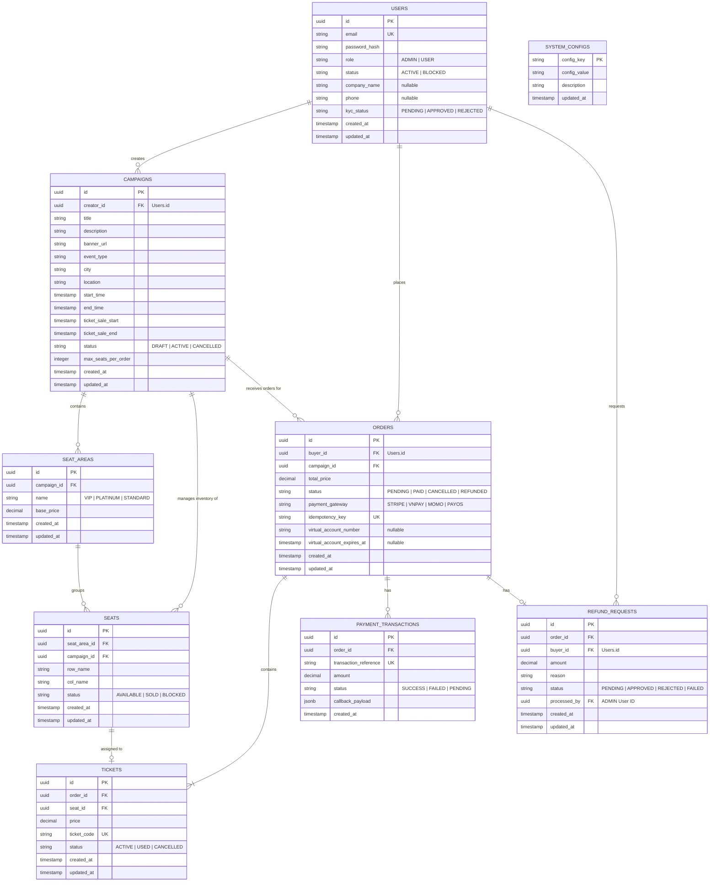
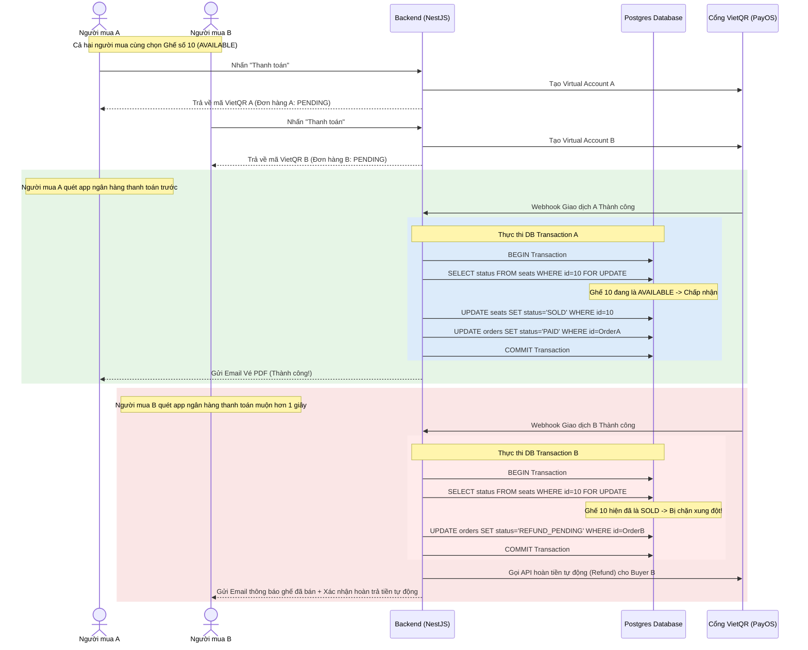

# Tài liệu Đặc tả Yêu cầu Hệ thống & Thiết kế ERD (SRS - Software Requirements Specification)

> [!IMPORTANT]
> **CẬP NHẬT KIẾN TRÚC QUAN TRỌNG**: 
> 1. **Gộp Vai trò**: Hợp nhất hoàn toàn hai vai trò `BUYER` (Người mua) và `ORGANIZER` (Nhà tổ chức) thành một vai trò duy nhất là **`USER` (Người dùng thông thường)**. Mỗi tài khoản người dùng mặc định vừa có thể mua vé, vừa có thể tự tạo chiến dịch sự kiện và bán vé.
> 2. **Loại bỏ cơ chế Giữ Chỗ (No Seat Hold)**: Loại bỏ toàn bộ chức năng giữ chỗ tạm thời (`HOLD`). Hệ thống áp dụng quy tắc **"Thanh toán trước được trước" (First-Pay-First-Served)**. Ghế chỉ chuyển sang trạng thái `SOLD` khi giao dịch thanh toán thực tế thành công. Trường hợp thanh toán chậm hoặc trùng ghế sẽ được tự động hoàn tiền.

---

## 1. Phân tích Vai trò (System Roles) & Ma trận Quyền

Hệ thống được tinh gọn tối đa thành 3 nhóm đối tượng chính:

| Vai trò | Ký hiệu | Mô tả ngắn |
| :--- | :--- | :--- |
| **Guest (Khách vãng lai)** | `GUEST` | Người chưa đăng nhập. Chỉ được xem thông tin sự kiện công khai và sơ đồ ghế. |
| **User (Người dùng hệ thống)** | `USER` | **[Hợp nhất]** Tài khoản người dùng tiêu chuẩn sau khi đăng ký. Có toàn quyền: Mua vé, thanh toán, đồng thời tự tạo sự kiện, thiết kế sơ đồ ghế, cấu hình bán vé và quản lý doanh thu sự kiện của chính mình. |
| **Admin (Quản trị viên)** | `ADMIN` | Quản trị viên hệ thống. Quản lý tài nguyên, kiểm duyệt thể loại sự kiện, phê duyệt KYC rút tiền của User, giám sát tải và can thiệp khẩn cấp. |

### Ma trận chức năng tối cao (High-Level Permission Matrix)

| Nhóm Chức năng / Module | Guest | User (Mua + Bán) | Admin |
| :--- | :---: | :---: | :---: |
| **Xem sự kiện & sơ đồ ghế trực quan** | ✅ | ✅ | ✅ |
| **Đăng ký / Đăng nhập tài khoản** | ✅ | ✅ | ✅ |
| **Thanh toán & Nhận vé điện tử (Mua)** | ❌ | ✅ | ❌ |
| **Quản lý đơn hàng mua & Vé của tôi** | ❌ | ✅ | ❌ |
| **Tạo mới Chiến dịch / Sự kiện (Bán)** | ❌ | ✅ | ✅ |
| **Thiết kế sơ đồ ghế & Giá vé chiến dịch** | ❌ | ✅ | ✅ |
| **Xem báo cáo doanh thu sự kiện tự tạo** | ❌ | ✅ | ✅ |
| **Đối soát & Quét QR check-in tại cổng** | ❌ | ✅ | ✅ |
| **Phê duyệt KYC rút tiền / Khóa tài khoản** | ❌ | ❌ | ✅ |
| **Cấu hình tham số hệ thống toàn cục** | ❌ | ❌ | ✅ |

---

## 2. Chi tiết Yêu cầu Chức năng (Functional Requirements)

### 2.1. Phân hệ Người dùng (User) - Quyền mua vé (Buyer Capabilities)
- **Đăng ký & Đăng nhập**: Đăng ký nhanh qua Email/Mật khẩu hoặc Google/Facebook.
- **Tìm kiếm sự kiện**: Tìm kiếm toàn văn (Full-text search), lọc theo thành phố, thời gian, thể loại sự kiện.
- **Mua vé trực tiếp (Không giữ chỗ)**:
  - Xem sơ đồ ghế trực quan hiển thị hai trạng thái: Trống (`AVAILABLE`) và Đã bán (`SOLD`).
  - Chọn một hoặc nhiều ghế trống và bấm thẳng vào nút **Thanh toán**.
  - Hệ thống sinh đơn hàng `PENDING` và cấp mã thanh toán VietQR (hoặc thẻ tín dụng Stripe). 
  - *Lưu ý*: Ghế vẫn ở trạng thái `AVAILABLE` trên sơ đồ cho đến khi có giao dịch thanh toán thành công đầu tiên được xác nhận từ Ngân hàng.
- **Nhận vé điện tử**: Sau khi tiền được ghi nhận thành công, hệ thống xuất vé định dạng PDF kèm mã QR Code duy nhất gửi qua email.
- **Quản lý lịch sử**: Xem danh sách vé đã mua, trạng thái vé (Chưa dùng, Đã quét check-in, Đã hủy).

### 2.2. Phân hệ Người dùng (User) - Quyền tạo sự kiện (Creator/Seller Capabilities)
- **Quản lý Chiến dịch sự kiện**:
  - Tạo và xuất bản chiến dịch bán vé: Nhập tiêu đề, mô tả, ảnh banner, thời gian diễn ra sự kiện.
  - Quản lý danh sách các sự kiện mình đã tạo kèm trạng thái hoạt động.
- **Thiết kế sơ đồ ghế**:
  - Thiết kế kéo thả phân chia khu vực ghế (VIP, GA...), đặt tên hàng/cột và gán giá vé tương ứng cho từng vùng ghế.
  - Cho phép import cấu hình sơ đồ ghế từ tệp CSV.
- **Quản lý bán vé & Check-in**:
  - Xem báo cáo doanh thu thời gian thực, tốc độ bán vé, số lượng vé đã bán trên tổng số ghế thiết kế.
  - Sử dụng camera điện thoại truy cập web để quét mã QR Code trên vé của khách hàng nhằm kiểm tra tính hợp lệ và ghi nhận check-in tại cửa sự kiện.
- **Rút tiền & KYC**:
  - Để rút tiền doanh thu bán vé, User cần cập nhật thông tin tài khoản ngân hàng và hồ sơ định danh (KYC) để Admin kiểm duyệt nhằm chống gian lận tài chính.

### 2.3. Phân hệ Quản trị viên (Admin)
- **Kiểm duyệt & Đối soát**:
  - Phê duyệt yêu cầu KYC rút tiền của các chủ sự kiện (Users).
  - Quản lý trạng thái tài khoản User (Kích hoạt hoặc Khóa khi phát hiện dấu hiệu gian lận hoặc bán vé giả).
- **Cấu hình hệ thống**:
  - Thiết lập tỷ lệ phí dịch vụ nền tảng (Platform Commission Fee) áp dụng cho doanh thu của mỗi chiến dịch bán vé.
  - Quản lý danh mục thể loại sự kiện, địa điểm lớn và thành phố.
- **Giám sát**: Theo dõi lượng giao dịch toàn hệ thống, xử lý khiếu nại tranh chấp dòng tiền.

---

## 3. Yêu cầu Phi chức năng (Non-Functional Requirements)

### 3.1. Tính nhất quán & Xử lý Tranh chấp Mua vé Đồng thời
Vì hệ thống đã loại bỏ cơ chế giữ chỗ tạm thời (`HOLD`), rủi ro lớn nhất là **xung đột thanh toán đồng thời (Payment Collision)** khi nhiều người cùng quét mã thanh toán cho một chiếc ghế trống tại cùng một thời điểm.

- **Mô hình "Thanh toán trước được trước" (First-Pay-First-Served)**:
  - Khi người dùng tạo mã VietQR thanh toán, ghế vẫn hiển thị là trống.
  - Khi Webhook thanh toán đầu tiên gửi về thành công, hệ thống sử dụng khóa bi quan Database `SELECT ... FOR UPDATE` trên dòng ghế đó.
  - Nếu trạng thái ghế vẫn là `AVAILABLE`: Chuyển ngay sang `SOLD` và hoàn tất đơn hàng.
  - Nếu trạng thái ghế đã bị chuyển sang `SOLD` bởi một giao dịch trước đó vài mili-giây: Đơn hàng hiện tại lập tức chuyển sang trạng thái `REFUND_PENDING` (Chờ hoàn tiền) và kích hoạt API tự động hoàn lại tiền cho tài khoản người mua thứ hai.
- **Cơ chế Idempotency**: Áp dụng Idempotency Key cho luồng xử lý Webhook thanh toán để tránh ghi nhận trùng đơn hàng khi cổng thanh toán gửi lại webhook.

### 3.2. Hiệu năng & Khả năng mở rộng
- **Tối ưu tầng Đọc (Read Cache)**: Trạng thái sơ đồ ghế được cache chặt chẽ trong Redis. Khi một ghế chuyển sang `SOLD`, cache Redis được cập nhật tức thì và phát đi WebSocket delta để đồng bộ màn hình tất cả người dùng khác, giảm thiểu các giao dịch thanh toán trùng lặp không đáng có.

### 3.3. Bảo mật (Security)
- Kiểm soát quyền chặt chẽ bằng JWT: Đảm bảo một User chỉ có quyền chỉnh sửa sơ đồ ghế và xem báo cáo doanh thu của chính sự kiện do tài khoản đó tạo ra (kiểm tra `creator_id == current_user_id`).

---

## 4. Thiết kế Mô hình Cơ sở Dữ liệu (Entity Relationship Diagram - ERD)

Dưới đây là sơ đồ quan hệ thực thể tinh gọn mô tả chi tiết cách tổ chức dữ liệu mới của hệ thống:



---

## 5. Từ điển Dữ liệu (Data Dictionary & Schema Specification)

### 5.1. Bảng `USERS` (Quản lý tài khoản toàn hệ thống)
Hợp nhất vai trò người mua và người bán. Các cột thông tin tổ chức (`company_name`, `kyc_status`) mặc định để trống cho đến khi User đăng ký mở tính năng tạo sự kiện.

| Tên cột | Kiểu dữ liệu | Ràng buộc | Mô tả |
| :--- | :--- | :---: | :--- |
| `id` | `UUID` | PK, Default `gen_random_uuid()` | Khóa chính duy nhất. |
| `email` | `VARCHAR(255)` | Unique, Not Null | Địa chỉ email đăng nhập hệ thống. |
| `password_hash` | `VARCHAR(255)` | Not Null | Mật khẩu băm an toàn. |
| `role` | `VARCHAR(20)` | Not Null, Default `'USER'` | Quyền truy cập: `ADMIN` hoặc `USER`. |
| `status` | `VARCHAR(20)` | Not Null, Default `'ACTIVE'` | Trạng thái tài khoản: `ACTIVE` hoặc `BLOCKED`. |
| `company_name` | `VARCHAR(255)` | Nullable | Tên công ty / thương hiệu đại diện khi tự tạo sự kiện. |
| `phone` | `VARCHAR(20)` | Nullable | Số điện thoại liên hệ đối soát doanh thu. |
| `kyc_status` | `VARCHAR(20)` | Not Null, Default `'PENDING'` | Trạng thái hồ sơ rút tiền: `PENDING`, `APPROVED`, `REJECTED`. |
| `created_at` | `TIMESTAMP` | Not Null, Default `NOW()` | Thời gian khởi tạo tài khoản. |
| `updated_at` | `TIMESTAMP` | Not Null, Default `NOW()` | Thời gian cập nhật gần nhất. |

### 5.2. Bảng `CAMPAIGNS` (Chiến dịch bán vé/Sự kiện)
| Tên cột | Kiểu dữ liệu | Ràng buộc | Mô tả |
| :--- | :--- | :---: | :--- |
| `id` | `UUID` | PK, Default `gen_random_uuid()` | Khóa chính duy nhất. |
| `creator_id` | `UUID` | FK (Users.id), Not Null | ID của người dùng tạo ra sự kiện này (Vai trò: `USER`). |
| `title` | `VARCHAR(255)` | Not Null | Tiêu đề sự kiện. |
| `description` | `TEXT` | Nullable | Mô tả chi tiết chương trình. |
| `banner_url` | `VARCHAR(512)` | Nullable | Ảnh bìa sự kiện. |
| `event_type` | `VARCHAR(50)` | Not Null | Thể loại: `CONCERT`, `SPORTS`, `THEATER`... |
| `city` | `VARCHAR(100)` | Not Null | Tỉnh / Thành phố diễn ra. |
| `location` | `VARCHAR(255)` | Not Null | Địa chỉ chi tiết. |
| `start_time` | `TIMESTAMP` | Not Null | Thời gian bắt đầu sự kiện. |
| `end_time` | `TIMESTAMP` | Not Null | Thời gian kết thúc sự kiện. |
| `ticket_sale_start` | `TIMESTAMP` | Not Null | Bắt đầu mở cổng thanh toán mua vé. |
| `ticket_sale_end` | `TIMESTAMP` | Not Null | Đóng cổng bán vé. |
| `status` | `VARCHAR(20)` | Not Null, Default `'DRAFT'` | Trạng thái: `DRAFT`, `ACTIVE`, `CANCELLED`. |
| `max_seats_per_order` | `INTEGER` | Not Null, Default `4` | Số lượng ghế tối đa được mua trong một giao dịch. |
| `created_at` | `TIMESTAMP` | Not Null, Default `NOW()` | Thời gian tạo chiến dịch. |
| `updated_at` | `TIMESTAMP` | Not Null, Default `NOW()` | Thời gian cập nhật chiến dịch. |

### 5.3. Bảng `SEATS` (Kho ghế vật lý)
*Loại bỏ hoàn toàn các trường giữ chỗ tạm thời (`current_holder_id`, `hold_expires_at`)*.

| Tên cột | Kiểu dữ liệu | Ràng buộc | Mô tả |
| :--- | :--- | :---: | :--- |
| `id` | `UUID` | PK, Default `gen_random_uuid()` | Khóa chính duy nhất. |
| `seat_area_id` | `UUID` | FK (Seat_Areas.id), Not Null | Thuộc vùng giá nào. |
| `campaign_id` | `UUID` | FK (Campaigns.id), Not Null | Thuộc chiến dịch sự kiện nào. |
| `row_name` | `VARCHAR(10)` | Not Null | Hàng ghế (Row A, B...). |
| `col_name` | `VARCHAR(10)` | Not Null | Tên cột / số thứ tự ghế. |
| `status` | `VARCHAR(20)` | Not Null, Default `'AVAILABLE'`| Trạng thái: `AVAILABLE` (Ghế trống), `SOLD` (Đã bán), `BLOCKED` (Khóa vật lý). |
| `created_at` | `TIMESTAMP` | Not Null, Default `NOW()` | Thời gian khởi tạo. |
| `updated_at` | `TIMESTAMP` | Not Null, Default `NOW()` | Thời gian cập nhật trạng thái gần nhất. |

> [!TIP]
> **Ràng buộc Duy nhất (Unique Constraint)**: Đặt unique composite key trên nhóm cột `(campaign_id, row_name, col_name)` để loại bỏ nguy cơ trùng lặp tọa độ ghế khi thiết kế sơ đồ.

---

## 6. Kiến trúc Giao dịch "Thanh toán trước được trước" & Giải pháp Đối soát Tranh chấp

Do không giữ chỗ trước, luồng thanh toán phải được bảo vệ chặt chẽ để xử lý tình trạng tranh chấp thanh toán trùng ghế.

### 6.1. Sơ đồ Luồng Giao dịch & Webhook Ngân hàng (No Hold Flow)



### 6.2. Triển khai Logic Database Lock (NestJS Blueprint)
Mẫu code backend sử dụng PostgreSQL Pessimistic Lock đảm bảo tính nguyên tử tuyệt đối tại thời điểm xử lý Webhook ngân hàng:

```typescript
async function processPaymentWebhook(orderId: string, seatIds: string[]): Promise<void> {
  const queryRunner = connection.createQueryRunner();
  await queryRunner.connect();
  await queryRunner.startTransaction();

  try {
    // 1. Khóa các dòng ghế liên quan để ngăn chặn giao dịch khác can thiệp đồng thời
    const seats = await queryRunner.manager.createQueryBuilder(Seat, "seat")
      .setLock("pessimistic_write")
      .where("seat.id IN (:...seatIds)", { seatIds })
      .getMany();

    // 2. Kiểm tra xem có ghế nào đã bị bán (SOLD) từ trước hay chưa
    const hasSoldSeat = seats.some(seat => seat.status === SeatStatus.SOLD);

    if (hasSoldSeat) {
      // Tình huống tranh chấp: Ghế đã bị mua trước bởi người khác
      await queryRunner.manager.update(Order, orderId, { status: OrderStatus.REFUND_PENDING });
      await queryRunner.commitTransaction();
      
      // Kích hoạt tiến trình hoàn trả tiền tự động qua cổng thanh toán
      await refundService.triggerAutoRefund(orderId);
      return;
    }

    // 3. Hợp lệ: Chuyển trạng thái ghế sang SOLD và hoàn tất đơn hàng
    await queryRunner.manager.update(Seat, seatIds, { status: SeatStatus.SOLD });
    await queryRunner.manager.update(Order, orderId, { status: OrderStatus.PAID });
    
    // 4. Sinh vé điện tử (Tickets)
    await ticketService.generateTicketsForOrder(orderId, seatIds, queryRunner.manager);

    await queryRunner.commitTransaction();
    await notificationService.sendTicketEmail(orderId);

  } catch (error) {
    await queryRunner.rollbackTransaction();
    throw error;
  } finally {
    await queryRunner.release();
  }
}
```
